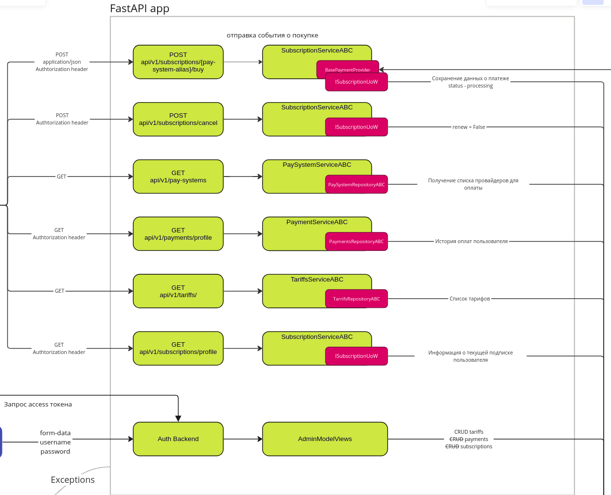
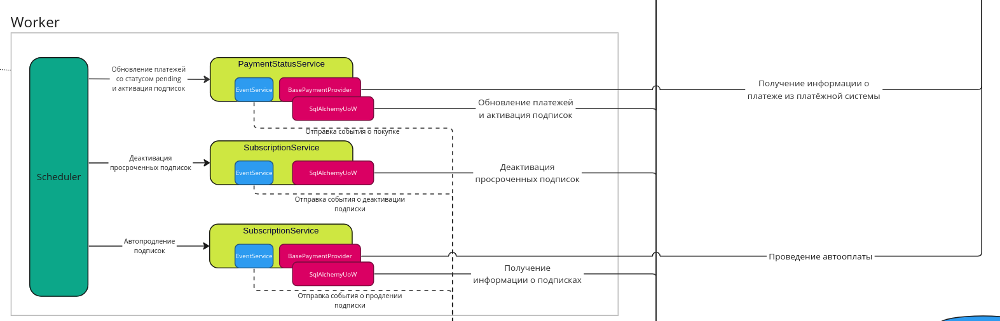
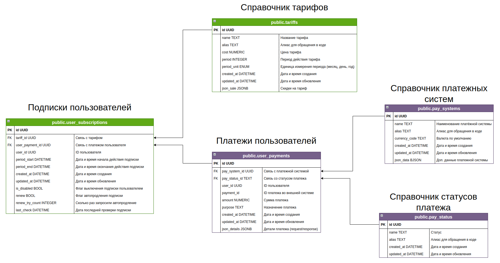

# Результаты дипломной работы

Ссылка на репозиторий - https://github.com/team21-movies-services/billing-service

Архитектурная схема проекта - https://miro.com/app/board/uXjVNdKG4aU=/?share_link_id=151324860603

В рамках дипломной работы был разработана система биллинга для онлайн-кинотеатра.

## Технологии:

1. В качестве backend фрейморка использовался Fastapi.
1. В качестве внешнего платежного шлюза использовалась [ЮKassa](https://promo.yookassa.ru/one_ruble). Это позволяет избежать хранения данных платежных карт непосредственно в сервисе биллинга. В архитектуру проекта также заложено подключение других различных платежных систем например [CloudPayments](https://cloudpayments.ru/), [Rocket Money](https://www.rocketmoney.com/) и т.п.
1. Для выполнения выполнения фоновых задач по обновлениям статусов платежей, деактивация просроченных подписок, автопродление подписок был разработан и внедрен планировщик заданий на основе библиотеки [scheduler](https://pypi.org/project/scheduler/). Запуск осуществляется изолированно в рамках docker контейнера с возможностью масштабирования.

## Эндпоинты и схема взаимодействия

1. Оплата подписки пользователя - https://github.com/team21-movies-services/billing-service/blob/main/src/app/api/routers/v1/subscriptions.py#L17
1. Текущая подписка пользователя - https://github.com/team21-movies-services/billing-service/blob/main/src/app/api/routers/v1/subscriptions.py#L37
1. Отмена автопродления подписки - https://github.com/team21-movies-services/billing-service/blob/main/src/app/api/routers/v1/subscriptions.py#L50
1. Список поддерживаемых систем оплат - https://github.com/team21-movies-services/billing-service/blob/main/src/app/api/routers/v1/pay_systems.py#L19
1. Список тарифов - https://github.com/team21-movies-services/billing-service/blob/main/src/app/api/routers/v1/tariffs.py#L19
1. История пользовательских платежей - https://github.com/team21-movies-services/billing-service/blob/main/src/app/api/routers/v1/payments.py#L26

## Выполнение фоновых задач

1. Автоматическое обновление статусов платежа - https://github.com/team21-movies-services/billing-service/blob/main/src/worker/services/payment.py#L20
1. Деактивация просроченных подписок - https://github.com/team21-movies-services/billing-service/blob/main/src/worker/services/subscription.py#L20

## Схема базы данных

Ссылка - https://drive.google.com/file/d/1vjEMku2iBeXOBpgojDEb3eaz7e-r1w4M/view?usp=sharing

Авторы:

* [Михаил Спиридонов](https://github.com/mspiridonov2706)
* [Леонид Баxметьев](https://github.com/leonidbkh)
* [Павел Xрамов](https://github.com/KhramovKhramov)
* [Ярослав Орлов](https://github.com/Avis20)

